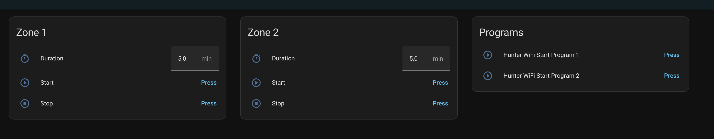

# Hunter WiFi for Home Assistant

Local Home Assistant integration for Hunter irrigation DIY WiFi controller that exposes HTTP API. More Info here [DmytryS/hunter-wifi](https://github.com/DmytryS/hunter-wifi) and here [ecodina/hunter-wifi](https://github.com/ecodina/hunter-wifi).

# Installation

The quickest way to install this integration is via [HACS][hacs-url] by clicking the button below:

[![Add to HACS via My Home Assistant][hacs-install-image]][hasc-install-url]

If it doesn't work, adding this repository to HACS manually by adding this URL:

1. Visit **HACS** → **Integrations** → **...** (in the top right) → **Custom repositories**
2. Click **Add**
3. Paste `https://github.com/DmytryS/ha-hunter-wifi` into the **URL** field
4. Chose **Integration** as a **Category**
5. **Hunter Wifi** will appear in the list of available integrations. Install it normally.

## Features

- Stateless action buttons:
  - start zone
  - start program
  - stop program

See [example dashboard](./examples/dashboard.yml) for a simple Lovelace view example.

## Reference

- Hunter WiFi API docs:
  - https://ecodina.github.io/hunter-wifi/#!pages/api.md

## License

MIT © [Dmytro Shvaika][DmytryS]

<!-- Badges -->

[gh-release-url]: https://github.com/DmytryS/ha-hunter-wifi/releases/latest
[gh-release-image]: https://img.shields.io/github/v/release/DmytryS/ha-hunter-wifi?style=flat-square
[gh-downloads-url]: https://github.com/DmytryS/ha-hunter-wifi/releases
[gh-downloads-image]: https://img.shields.io/github/downloads/DmytryS/ha-hunter-wifi/total?style=flat-square
[hacs-url]: https://github.com/hacs/integration
[hacs-image]: https://img.shields.io/badge/hacs-default-orange.svg?style=flat-square
[twitter-url]: https://twitter.com/DmytroShvaika
[twitter-image]: https://img.shields.io/badge/twitter-%40DmytroShvaika-00ACEE.svg?style=flat-square

<!-- References -->

[home-assistant]: https://www.home-assistant.io/
[DmytryS]: https://github.com/DmytryS
[hasc-install-url]: https://my.home-assistant.io/redirect/hacs_repository/?owner=DmytryS&repository=ha-hunter-wifi&category=integration
[hacs-install-image]: https://my.home-assistant.io/badges/hacs_repository.svg
[add-translation]: https://github.com/DmytryS/ha-hunter-wifi/blob/master/contributing.md#how-to-add-translation
[eveus-telegram]: https://t.me/Eveus_Chargers
[eveus]: https://www.eveus.com.ua
